## Overview

This is *Funky Timer*, my course project for EE110 and EE120 Fall 2023 at MassBay. Funky Timer is a variation of a popular circuit: a digital piano based on a 555 timer. It uses relatively simple off-the-shelf parts to create a range of pre-selected frequencies which can be played back through a speaker.

## The Circuit

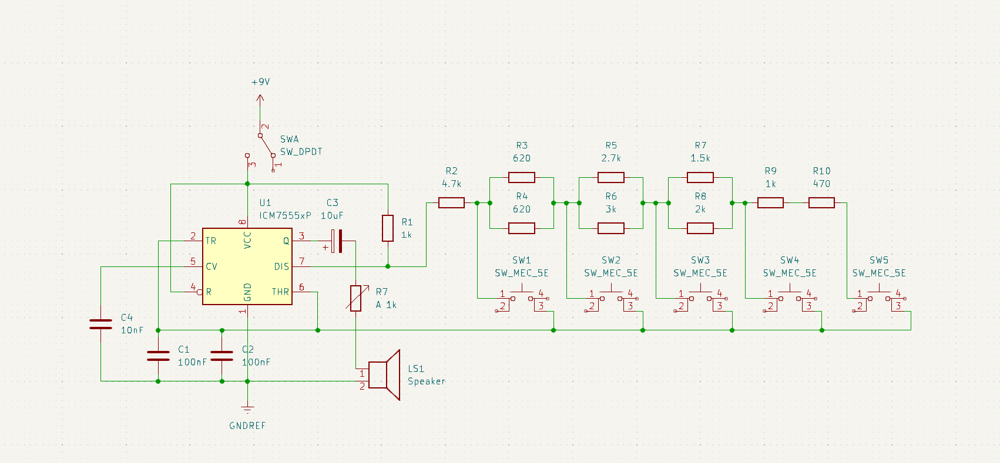

This is my final circuit built in KiCad. Funky Timer generates tones using a 555 timer as an oscillator. In broad terms, an oscillator is a type of electronic circuit used to generate a repeating signal – in this case, a square wave. The speed at which this signal switches on and off matches the frequency of the tone produced, so a 440 Hz signal will produce sound waves that cycle 440 times each second. We perceive this as the musical note A above middle C.

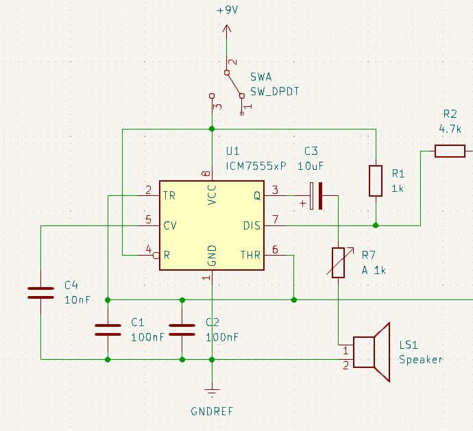

The trickiest part to understand is the 555 timer on the left. In this configuration, the 555 timer is wired up as an astable multivibrator, which means it produces an oscillating signal. I like using [Falstad’s circuit simulator](https://www.falstad.com/circuit/) as a quick way to visualize the way things are moving around in a circuit, so I put together this section of the circuit to show what the output looks like.

 

<video width=100% controls>
    <source src="/projects/funkytimer/FunkyTimer_FalstadDemo.webm" type="video/webm">
    Your browser does not support the video tag.  
</video>



With this setup, we’re watching the capacitor, C1, as it charges through the resistors, R1 and R2. When it reaches ⅔ VCC, it triggers the upper comparator and changes the state of the flip-flop, which then turns off the discharge transistor and causes the output to go high. At this point, the capacitor starts discharging – but now only through R2. When the voltage across the capacitor drops to 1/3​ of the supply voltage, the lower comparator triggers. This resets the flip-flop, turning on the discharge transistor, and the output goes low. The capacitor begins charging again, and the cycle repeats. If you want to play with this circuit yourself, right click and save [this .txt file](funkytown.txt) to import it into Falstad's circuit simulator.

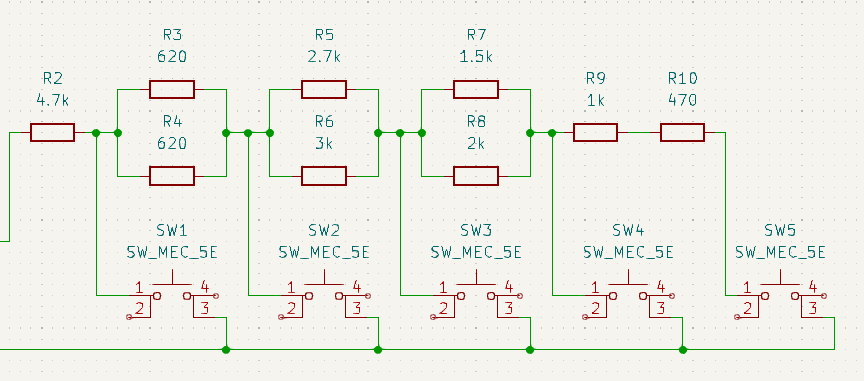

The rest of the circuit is a simple series circuit. Several push buttons are wired in series with different resistor values in between each. The combination of these resistors equals R2. By carefully picking out resistors, I can produce different signals oscillating at different frequencies based on which button is used to complete the circuit.

## Building the Circuit

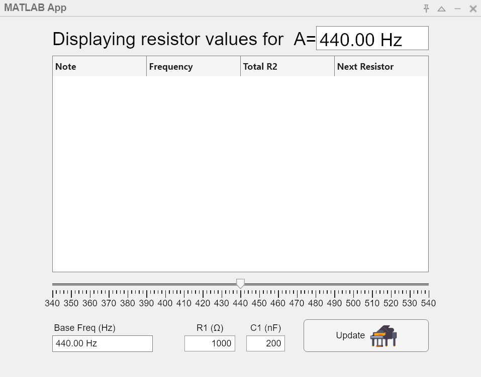

This simple GUI – a neat demonstration of MATLAB’s app design capabilities – proved instrumental in choosing component values. The GUI uses a for loop and basic algebra to populate the table based on user input. It calculates a range of frequencies from C4 (or middle C) to G#5/Ab5 based on the user-defined reference tuning from 340-540 Hz. While I am not aware of any era in music where tunings as low as 340 Hz or as high as 540 Hz were the standard, I also believe it’s important to be your own person: you shouldn’t let the constraints of western music theory weigh you down when choosing a reference frequency in this GUI. Or, I guess you should constrain yourself, but only from 340-540 Hz.

To make use of the GUI, three values are needed: Base Freq (or reference pitch), R1, and C1.

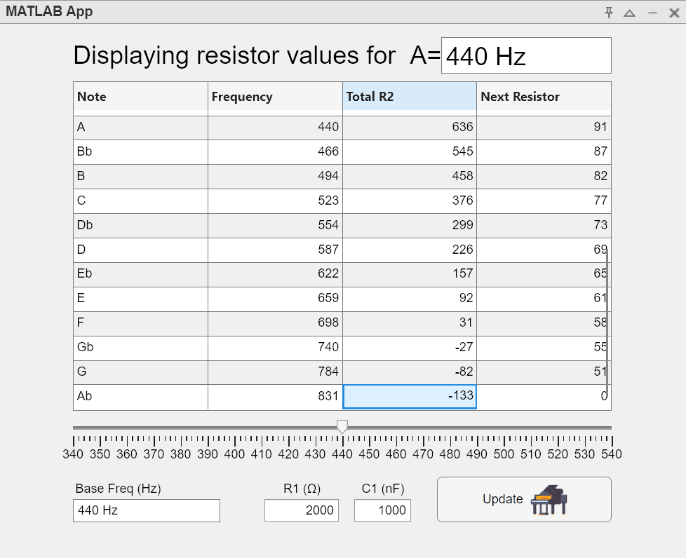

The first value I input is 440 Hz and I can see the relative frequencies update accordingly in the *Frequency* column. R1 and C1, however, are less arbitrary. Here, using a 0.1μF capacitor for C1 and a 2kΩ resistor for R1, we start seeing negative numbers related to higher frequencies. This means that using these components as starting elements, the highest frequency I can produce is somewhere between F5 and Gb5. The critical bit to understand is that as resistance and capacitance increase, the 555 timer’s output oscillates more slowly. Slower oscillations mean lower frequencies.

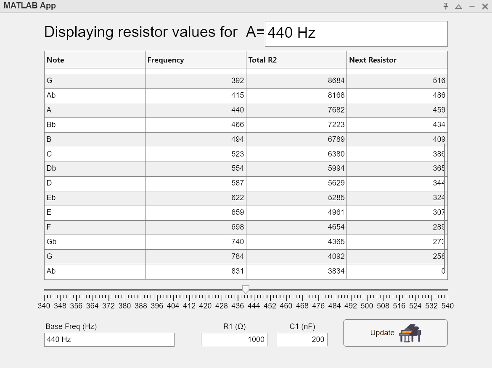

Trying out different values leads me to choose R1 = 1kΩ and C1 = 200nF as the default option for the GUI. These values allow for sensible steps in resistance between frequencies so that I can easily mix and match resistors to meet my precise needs. I get out a 1kΩ resistor for R1 and test it using a DMM to find it has a value of 991Ω, so that’s the number I include. I put 200nF for C1 because I have too much faith in capacitor manufacturing tolerances, a decision which I’m already well aware is bound to cause problems downstream. “[This is fine,](/projects/funkytimer/this_is_fine.jpg)” I casually mutter to myself, “this project is due in 48 hours anyway.” I click Update and the table populates with new values. The only column affected is Total R2, meaning this choice will only minorly affect the first R2 resistor in my circuit.

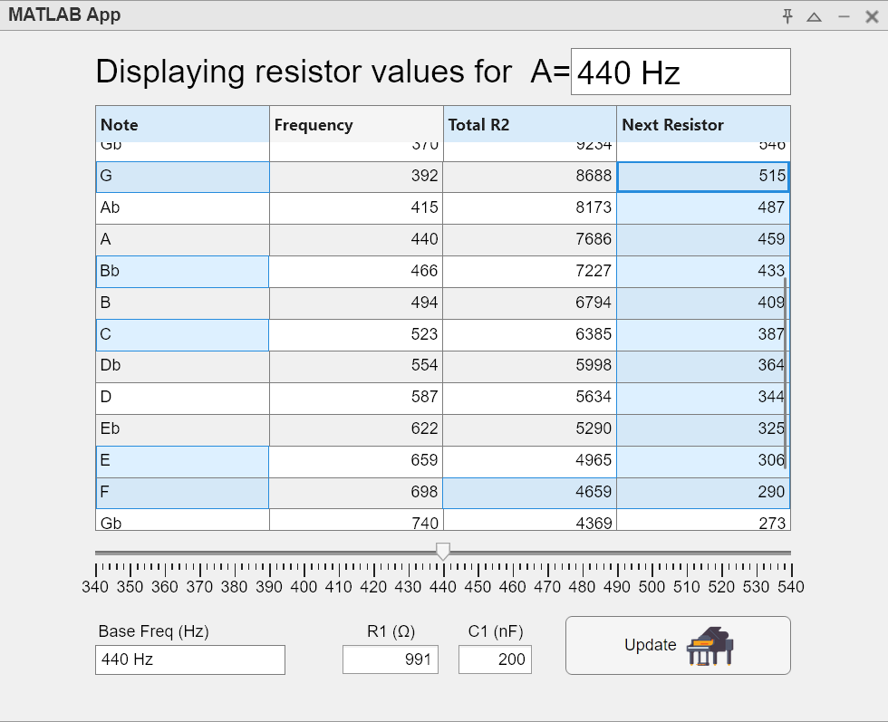

Next, I need to consider the fundamental frequencies I want to represent. Based on the music I’ve chosen to play, I’m looking to produce five frequencies: G4 = 392 Hz, Bb4 = 466 Hz, C5 = 523 Hz, E5 = 659 Hz, and F5 = 698 Hz. Lower frequencies are generated as we add more resistors in series, so I start from the bottom up with the highest frequency I’m looking to produce, 698 Hz. To achieve this frequency with the values of R1 and C1 I’ve chosen, I check the Total R2 column to find I’ll need an R2 value of roughly 4659Ω.

This table lists the values I end up with start with the first resistor I'll be using (698 Hz):

   Note  | Freq (Hz)  | Next R |
---------|------------|--------|
       F |    698     |   4659 |
       E |    659     |    306 |
       C |    523     |   1420 |
      Bb |    466     |    842 |
       G |    392     |   1461 |

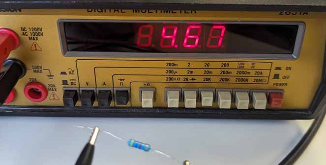

The closest resistor I can find is 4.7kΩ, so that’s what I choose. The colors on this resistor are yellow, violet, red, and gold, corresponding to 4.7kΩ with a tolerance of +/-5%, so its actual resistance can range from 4.465kΩ to 4.935kΩ. With a DMM, I can see this particular resistor measures at 4.67kΩ, very close to the ~4.66kΩ I’m looking for.

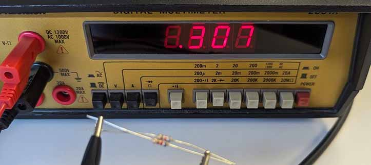

To generate my next note, 659 Hz, I need R2 = 4965Ω. However, I’ve already got a 4.67kΩ resistor in this network, so I only need to add a much smaller resistor in series to achieve this resistance. By referencing the fourth column, Next Resistor, I can easily see what value I need. To produce a 659 Hz tone, I only need to include a 306Ω resistor. I often find that small resistors tend to undershoot rather than overshoot their expected values, so I’m going to pass on testing any 300Ω resistors and instead opt for two 620Ω resistors in parallel to achieve a resistance just below 310Ω. As I’d hoped, these produce a resistance of 307Ω together.

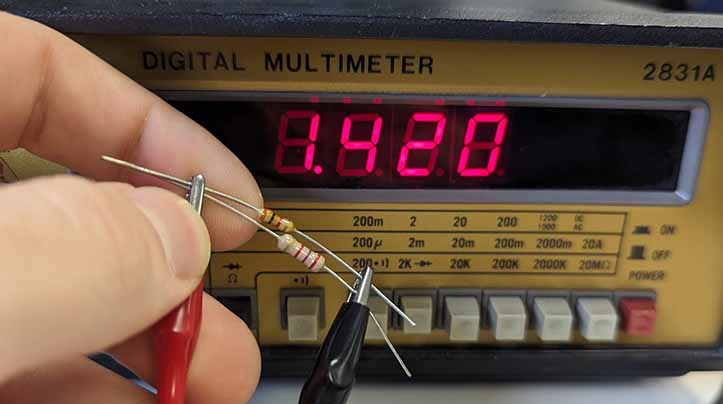

At this point, I’m not interested in any of the notes between C and E: I’m a simple man looking to play a simple melody from the year 1980. I add up the Next Resistor values between 523 Hz and 659 Hz or, conversely, look at the difference between Total R2 in these rows to arrive at a value of 1420Ω. A 3kΩ and 2.7kΩ resistor in parallel happen to produce the exact value I need.

I move on to my next frequencies using the same method and eventually, my circuit is complete. The 555 timer’s output on pin 3 is a signal rapidly switching on and off at varying frequencies depending on which button is pressed. By plugging a speaker in, we can hear what the oscillating signal, or square wave, sounds like: when the signal is high, the speaker’s diaphragm flexes out, but when it’s off, it flexes in. Human ears perceive the sound wave this produces as a steady tone which increases in pitch as the frequency increases.

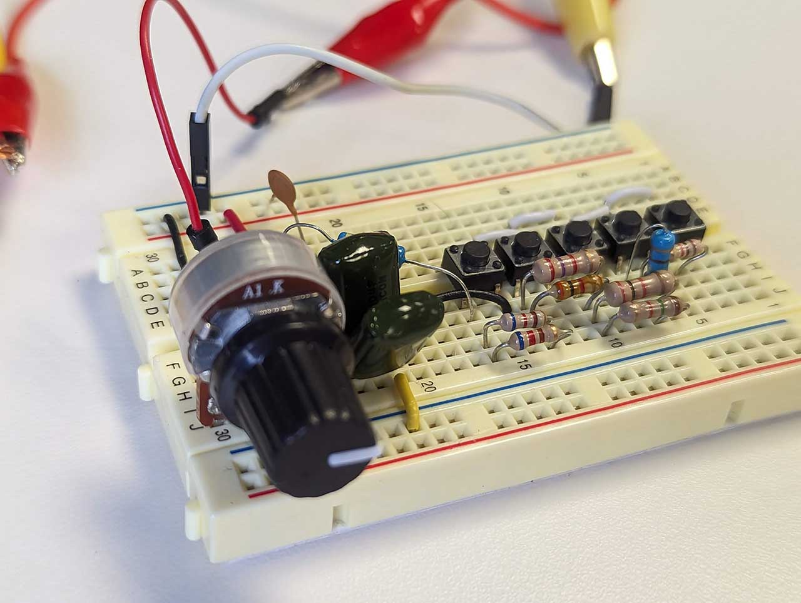
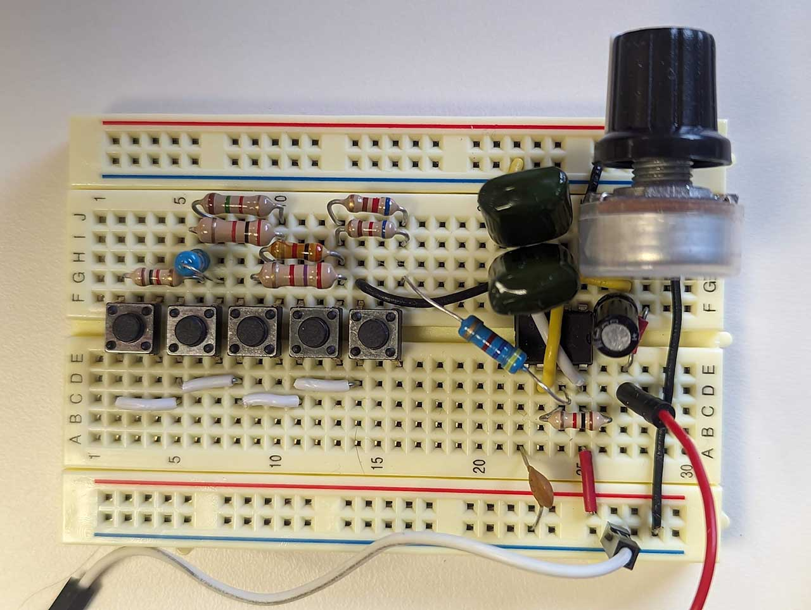

To check my precision, I pull out a tuner. All of my notes are in tune relative to each other, but I find the entire piano is slightly flat. Remember when I said you should test your resistors? Well, you should also test C1. I had initially decided to use two 100nF ceramic capacitors in parallel, but after building my circuit, I found they were unreliable so I switched to slightly less unreliable mylar caps. The actual value I’ve achieved from the two film caps is in fact closer to 205nF which has led to a slightly flat piano. Despite this, the notes are in tune relative to each other and the desired melody is easily played.

This is the final build in action:

 

<video width=100% controls>
    <source src="/projects/funkytimer/FunkyDemo.webm" type="video/webm">
    Your browser does not support the video tag.  
</video>



Thank you for checking out this project!